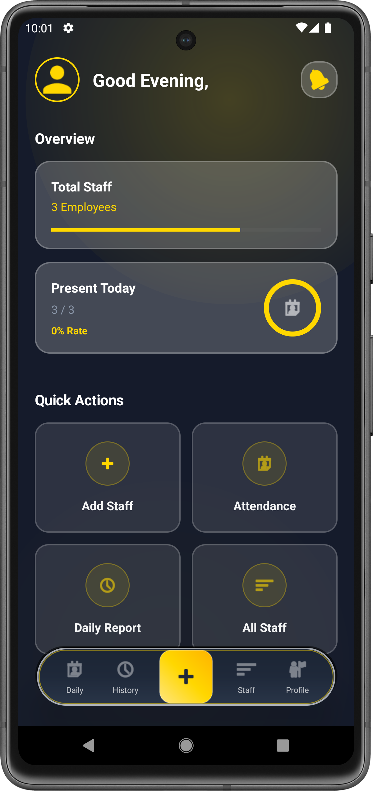
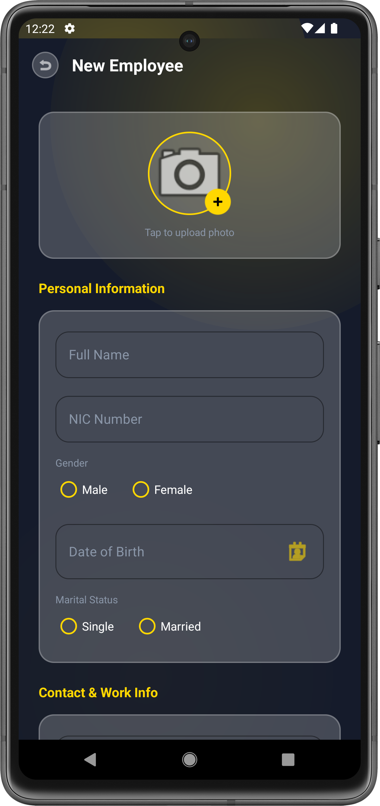
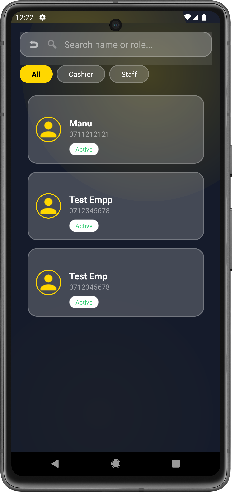
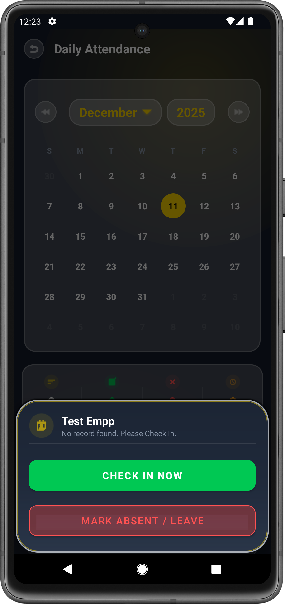
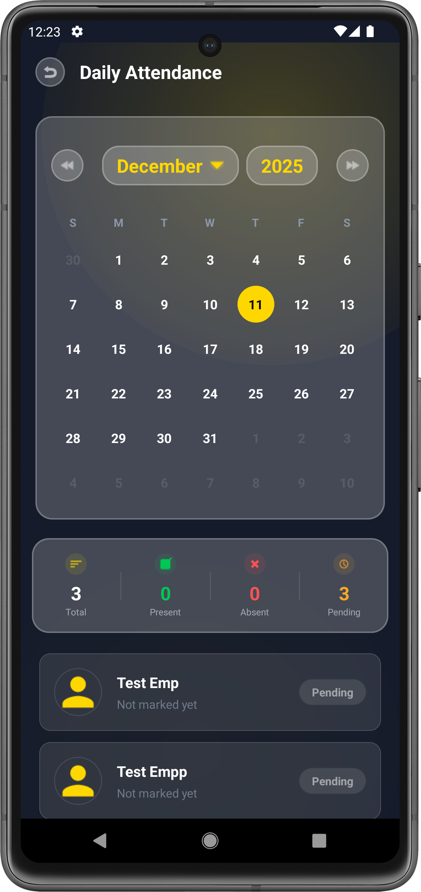

# Staff Core - Employee Management System

> **A Premium, Modern Solution for Staff Administration**

**Staff Core** is a robust Android application designed to streamline employee management and attendance tracking. Built with a focus on User Experience (UX), it features a unique **"Dark Glass & Neon Gold"** design language, ensuring that managing staff is not only functional but also visually stunning.

## Key Features

### Smart Dashboard
* **Real-time Statistics:** View total employees, present count, absent count, and pending attendance at a glance.
* **Dynamic Greeting:** Personalized greeting based on the time of day.
* **Quick Actions:** Fast access to marking attendance, adding staff, and viewing reports.

### Employee Management
* **Comprehensive Profiles:** Store details including NIC, Contact Info, Address, and Joined Date.
* **Image Handling:** Integrated **uCrop** library for cropping and rotating profile pictures and documents.
* **Document Storage:** Save ID (Front/Back) and CV images with a sleek overlay UI.
* **Smart Validation:** Strict validation logic for phone numbers, NICs, and required fields.

### Attendance System
* **Easy Marking:** Floating bottom sheet to Mark Check-In, Check-Out, or Leave.
* **Status Tracking:** Auto-updates status to Present (Green), Absent (Red), or Pending (Orange).
* **Logic-Based Filtering:** Reports automatically filter employees based on their **Joined Date** (employees aren't listed before they joined).

### Reports & History
* **Daily Reports:** View attendance logs for any specific date.
* **Custom Date Picker:** A unique Glassmorphism bottom sheet to select Month & Year easily.

## UI/UX Design

The app follows a strict **Dark & Gold** theme:
* **Glassmorphism:** Cards and dialogs feature a frosted glass effect.
* **Neon Gold Accents:** Buttons, inputs, and highlights use a premium gold color (`#FFD700`).
* **Animations:** Smooth transitions and background glow effects.
* **Vector Icons:** Custom-designed gold avatars and indicators.

## Tech Stack

* **Language:** Java (Android SDK)
* **Database:** SQLite (Custom DAO Pattern)
* **Image Loading:** Glide
* **Image Cropping:** uCrop (Yalantis)
* **UI Components:** Material Design, CardView, RecyclerView, ConstraintLayout

## Screenshots

  
  
  
   
  
  

## Installation

1.  Download the latest **APK** from the [Releases Section](https://github.com/manujayagunathilaka/staffcore-android/releases).
2.  Install `StaffCore_v1.0.apk` on your Android device.
3.  Grant necessary storage permissions for profile photo uploads.

## Future Roadmap (v1.1)

* [ ] Admin Profile & Authentication.
* [ ] Edit Employee Details feature.
* [ ] Salary Advance Management.
* [ ] PDF Report Generation.

## Contributing

Contributions, issues, and feature requests are welcome!
Feel free to check the [issues page](https://github.com/manujayagunathilaka/staffcore-android/issues).

**Developed by Manujaya Gunathilaka**
